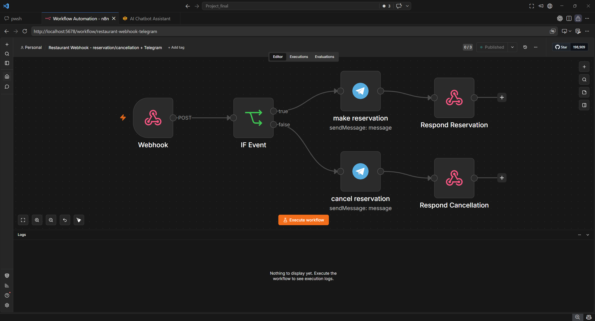

# Task 4 — AI Chatbot Assistant + n8n

Restaurant AI Agent with n8n notifications.  
Handles reservations, cancellations, menu questions, and opening hours.

Built with **Python**, **Gradio**, **SQLite**, **OpenAI**, **Docker**, and **n8n**.

Based on [Assignment 4 — Restaurant Agent + n8n](https://pythonai200425.github.io/finals/04-n8n-restaurant.html).

---

## Features

- Natural-language reservation booking
- LLM extraction of: `customer_name`, `date`, `time`, `party_size`, `contact`
- Soft-delete cancellation by booking ID (`status = 'cancelled'`)
- SQLite `reservations` table
- Intent classifier: `reservation` | `cancellation` | `menu` | `hours` | `general`
- OpenAI classification with keyword fallback
- Webhook notifications on **booking and cancellation**
- n8n workflow: Webhook → IF (by `event`) → two notification branches
- Telegram notifications (bonus)
- Gradio web chat UI

---

## Project Structure

```text
04-n8n_docker/
├── restaurant_chatbot.py   # Classifier, handlers, Gradio UI, _notify_n8n
├── restaurant_db.py        # initialize_database, book/cancel/get helpers
├── n8n_workflow.json       # Importable n8n workflow
├── docker-compose.yml      # Local n8n via Docker
├── requirements.txt
├── .env.example            # Environment template (no secrets)
├── .gitignore
├── README.md
└── screenshots/            # Demo screenshots
```

> `.env` and `restaurant.db` are local only (ignored by Git).

---

## Requirements

- Python 3.10+
- Docker Desktop (for n8n)
- OpenAI API key

---

## Setup

### 1. Install dependencies

```powershell
pip install -r requirements.txt
```

### 2. Configure environment

```powershell
copy .env.example .env
```

Edit `.env`:

```env
OPENAI_API_KEY=sk-your-openai-key-here
OPENAI_MODEL=gpt-4o-mini
N8N_WEBHOOK_URL=http://localhost:5678/webhook/restaurant
RESTAURANT_DB=restaurant.db
```

**Do not commit `.env`.**

---

## Run n8n

```powershell
docker compose up -d
```

1. Open [http://localhost:5678](http://localhost:5678)
2. Import `n8n_workflow.json`
3. Activate / publish the workflow

Webhook used by the chatbot:

```text
POST http://localhost:5678/webhook/restaurant
```

n8n flow:

1. **Webhook** node — method `POST`, path `restaurant`
2. **IF** node — splits on `event == reservation`
3. **Two branches** — different messages for reservation vs cancellation
4. **Respond to Webhook** (+ Telegram as bonus)

---

## Run the Chatbot

```powershell
python restaurant_chatbot.py
```

Open: [http://127.0.0.1:7860](http://127.0.0.1:7860)

### Example messages

```text
Order table for Lina at 19:55 tonight for 4
Cancel reservation number 42
What do you have for dessert?
What time are you open?
```

---

## How It Works

1. User sends a message in Gradio
2. `classify_question()` routes to: `reservation` / `cancellation` / `menu` / `hours` / `general`
3. `_handle_reservation()` extracts details (LLM → JSON) and validates required fields
4. `book_reservation()` saves to SQLite and returns the booking ID
5. `_notify_n8n(data, event="reservation")` POSTs JSON to n8n
6. For cancellations: extract booking ID → `cancel_reservation()` → `_notify_n8n(..., event="cancellation")`
7. n8n IF node routes by `event` and sends the matching notification

### Reservation payload example

```json
{
  "event": "reservation",
  "id": 42,
  "customer_name": "Lina",
  "date": "2026-08-01",
  "time": "19:55",
  "party_size": 4
}
```

Cancellation uses the same webhook with `"event": "cancellation"`.

---

## Test the Webhook (PowerShell)

**Reservation**

```powershell
$body = '{"event":"reservation","customer_name":"Stav","date":"2026-08-01","time":"19:30","party_size":4,"id":102}'
Invoke-WebRequest -Uri "http://localhost:5678/webhook/restaurant" -Method POST -ContentType "application/json" -Body $body
```

**Cancellation**

```powershell
$body = '{"event":"cancellation","id":102}'
Invoke-WebRequest -Uri "http://localhost:5678/webhook/restaurant" -Method POST -ContentType "application/json" -Body $body
```

---

## Screenshots

### Gradio — AI Chatbot Assistant


### n8n Workflow




---

## Security Notes

- Keep API keys only in `.env`
- `.gitignore` excludes: `.env`, `env`, `*.db`, `__pycache__/`, `.venv/`, logs, n8n runtime data
- Share `.env.example` only (never real secrets)
```